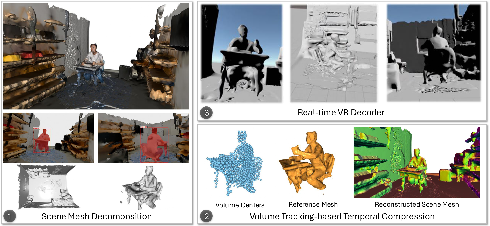

<div align="center">

# TSMC: Time-varying 4D Scene Mesh Compression
Guodong Chen, Libor Váša, Amrita Mazumdar, Mallesham Dasari
<p align="center">
  
  
  
</p>



### [📄 Paper](assets/TSMC_SIGGRAPH_2026.pdf) | [🌐 Project Page](https://frozzzen3.github.io/TSMC/)
</div>

This repository contains the official authors implementation associated with the paper "TSMC: Time-varying 4D Scene Mesh Compression".


## TODOs
- [x] SAM3-based dynamic and static mesh differentiation
- [x] TSMC dynamic compression
- [ ] VR headset decoder and playback system (check out [this](https://github.com/SINRG-Lab/4D_Mesh_Decoder_UnityPlugin), will integrate it soon)


## BibTex
```
@inproceedings{chen2026tsmc,
  title={TSMC: Time-varying 4D Scene Mesh Compression},
  author={Chen, Guodong and Váša, Libor and Mazumdar, Amrita and Dasari, Mallesham},
  booktitle={Proceedings of the Special Interest Group on Computer Graphics and Interactive Techniques Conference Conference Papers},
  pages={1--12},
  year={2026}
}
```

## Step-by-step Tutorial

### Cloning the Repository
The repository contains submodules Draco, thus please clone recursively:
```
git clone https://github.com/SINRG-Lab/TSMC.git --recursive
```

### Overview
The codebase has 3 main components:
- **SAM3-based dynamic and static mesh differentiation**
- **TSMC dynamic mesh compression**
- **Real-time decoder and playback system**

The components have different requirements w.r.t. both hardware and software. 
They have been tested on and Ubuntu Linux 24.04 and Meta Quest 3. 
Instructions for setting up and running each of them are found in the sections below.

### System Requirements
- **Operating System**: Ubuntu Linux 24.04
- **Python**: 3.12

### Setup
Our default environment is based on Conda package and environment management:
```aiignore
conda env create --file environment.yml
conda activate tsmc
```
Install .NET 7.0 and 5.0 for Ubuntu 24.04:
```aiignore
wget https://dot.net/v1/dotnet-install.sh -O dotnet-install.sh
./dotnet-install.sh --version 7.0.202 
./dotnet-install.sh --channel 7.0
./dotnet-install.sh --channel 7.0 --runtime aspnetcore
./dotnet-install.sh --version 5.0.408
./dotnet-install.sh --channel 5.0 --runtime aspnetcore
```
Set up dotnet path if needed (when you cannot run dotnet commands):
```aiignore
export DOTNET_ROOT=$HOME/.dotnet
export PATH=$HOME/.dotnet:$PATH
```

### Running
Prepare your mesh sequences in `./data` or test with our provided sample meshes.

Run `run.sh` to start the whole pipeline. Or you can run each component separately as follows:

#### 1. Static and Dynamic Scene Decomposition
TSMC's static scene decomposition is based on SAM3, installation instructions and pretrained models can be found [here](https://github.com/facebookresearch/sam3).

`./tsmc` directory contains notebooks demonstrating how to use this:
- `sam3_mesh_segmentation.ipynb`: example using `Answering` dataset.
- `sam3_mesh_segmentation_auto.ipynb`: example using `Synthetic` dataset with an automatic dynamic part identification based on motion changes.

After running the notebooks, you will find the static and dynamic meshes in `./data/<dataset_name>/dynamic>` and `./data/<dataset_name>/static>` directories.


#### 2. Get volume centers for the dynamic part of the input mesh sequence
First prepare config files, as configuration files in `./arap-volume-tracking/config/` directory:
```
<?xml version="1.0"?>
<Config xmlns:xsd="http://www.w3.org/2001/XMLSchema" xmlns:xsi="http://www.w3.org/2001/XMLSchema-instance">
  <firstIndex>0</firstIndex>
  <lastIndex>9</lastIndex>
  <inDir>data/<dataset_name></inDir>
  <fileNamePrefix>frame_0</fileNamePrefix>
  <outDir>output/<output_dir></outDir>
  <volumeGridResolution>512</volumeGridResolution>
  <pointCount>2000</pointCount>
  <gradientThreshold>0.0001</gradientThreshold>
  <smoothSigma>0.125</smoothSigma>
  <smoothSigma2>0.125</smoothSigma2>
  <falloffStrength>0.05</falloffStrength>
  <applySmooth>1</applySmooth>
  <applyLloyd>1</applyLloyd>
</Config>
```
Usually you only need to change index and path. You can also change the following parameters:
- mode Tracking mode
  - process IIR - IIR affinity based tracking
  - process or unspecified - Max afinity based tracking
  - improvement - Global optimisation (requires first running any of the forward tracking modes)
- inDir - directory with input data
- fileNamePrefix - the name of data files excluding the last 3 numbers (eg. mesh_0)
- firstIndex/lastIndex - number of the first/last file (eg. for 0, the first file is mesh_0000.obj)
- outDir - directory for output files
- volumeGridResolution - the resolution of volume grid in the largest direction for data processing
- pointCount - the number of tracked point
- gradientThreshold - threshold for gradient element size for stopping optimization
- smoothSigma - controls falloff for distance based affinity
- smoothSigma2 - controls falloff transformation difference based affinity
- falloffStrength - controls IIR filter
- applySmooth - weight for smoothness term
- applyLloyd - weight for uniformness term
- filterCount - number of centers to be removed each improvement (GO mode only)
- numberOfImprovements - number of improvement attempts (GO mode only)
- maxIt - maximum number of iterations each improvement (GO mode only)

Then you can run volume tracking and get centers like this:
```
cd ./arap-volume-tracking/
dotnet ./bin/Client.dll ./config/max/<config.xml>
```
e.g.,
```
cd ./arap-volume-tracking/
dotnet ./bin/Client.dll ./config/config-answering-max.xml 
```

#### 3. Get reference centers, which is for getting self-contact-free reference mesh:
```
python ./get_reference_center.py --dataset answering --num_frames 10 --num_centers 2000 --centers_dir ../arap-volume-tracking/output/answering-2000/ --group 
```

group: Group index (e.g., group=1 frame[0:num_frames]).

#### 4. Calculate centers transformations
```
python ./get_transformation.py --dataset answering --num_frames 10 --num_centers 2000 --centers_dir ../arap-volume-tracking/output/answering-2000 --firstIndex 0 --lastIndex 9```
```
#### 5. Now we have transformations for centers. We use this to deform each frame in the group to reference centers.
```
cd ../tvm-editing/

TVMEditor.Test/bin/Release/net5.0/TVMEditor.Test answering 1 0 9 "./TVMEditor.Test/bin/Release/net5.0/Data/answering_2000/" "./TVMEditor.Test/bin/Release/net5.0/output/answering_2000/"
```
There are 3 numbers after `<dataset_name>`, the first one is to set the deformation mode, 1 represents deforming meshes into reference shape, and 2 represents deforming reference mesh into different shapes. The following 2 numbers are --firstIndex 0 --lastIndex 9.


#### 6. Next, we can extract a reference mesh based on these deformed meshes. 
```
cd ../tsmc/

python ./extract_reference_mesh.py --dataset answering --num_frames 10 --num_centers 2000 --inputDir ../tvm-editing/TVMEditor.Test/bin/Release/net5.0/output/answering_2000/output/ --outputDir ../tvm-editing/TVMEditor.Test/bin/Release/net5.0/Data/answering_2000/reference_mesh/ --firstIndex 0 --lastIndex 9 --key 6
```

#### 7. Deform the reference mesh into different shapes to get approximation of each frame in the group
```
cd ../tvm-editing/

TVMEditor.Test/bin/Release/net5.0/TVMEditor.Test answering 2 0 9 "./TVMEditor.Test/bin/Release/net5.0/Data/answering_2000" "./TVMEditor.Test/bin/Release/net5.0/output/answering_2000"
```

#### 8. Subdivided meshes to the originals and get displacements
```
cd ../tsmc/
python ./get_displacements.py --dataset answering --num_frames 10 --num_centers 2000 --target_mesh_path ../arap-volume-tracking/data/answering --firstIndex 0 --lastIndex 9 --group_idx 1```
```
#### 9. Compress displacements

```
python compress_displacements.py --dataset answering --num_frames 10 --num_eigenvectors 3 --displacement_path ../tvm-editing/TVMEditor.Test/bin/Release/net5.0/output/answering_2000/reference --output_path ../tvm-editing/TVMEditor.Test/bin/Release/net5.0/output/answering_2000/reference --firstIndex 0 --lastIndex 9 --reference_mesh_path ../tvm-editing/TVMEditor.Test/bin/Release/net5.0/Data/answering_2000/reference_mesh/others/decoded_decimated_reference_mesh.obj
```
`num_eigenvectors` decides the trade-off between quality and bitrate.

#### 10. Evaluation

```
python evaluation.py --dataset answering --num_frames 10 --num_centers 2000 --input_path ../tvm-editing/TVMEditor.Test/bin/Release/net5.0/output/answering_2000/reference  --dynamic_static_path ../data/answering/meshes --firstIndex 0 --lastIndex 9 --reference_mesh_path ../tvm-editing/TVMEditor.Test/bin/Release/net5.0/Data/answering_2000/reference_mesh/others/decoded_decimated_reference_mesh.obj --group_idx 1
```
